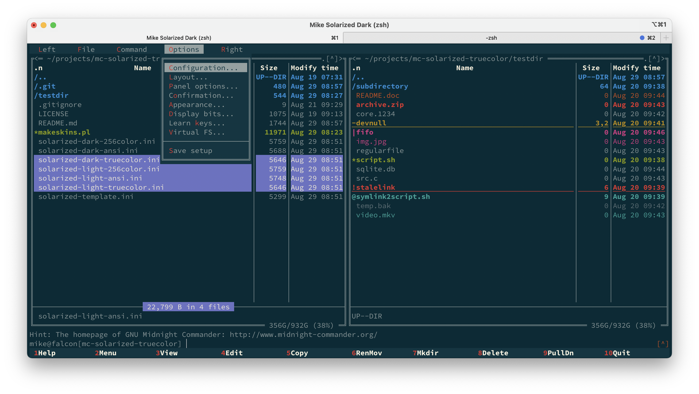

# Solarized skins for midnight commander in ANSI/256-color/truecolor variants

This skin is based on denius/mc-solarized-skin, which uses ANSI colors and requires a customized ANSI color palette in
the terminal configuration. Note that while I used that Skin as a basis, I have adapted the colors so it is not meant to
look the same. For example, the original skin uses light colors for menus in the dark skin variant. I changed it to use
dark colors in the dark skin, light colors in the light skin. I tend to use the dark skin in dim-lit rooms, and in such
cases find it irritating to have larger areas of bright color.

Nowadays, pretty much all terminal emulators support 256-color modes, and even truecolor (16 million colors) is getting
commonly available.

This repository provides solarized skin variants with color definitions from the 256-color palette as well as truecolor
definitions. The upside is that with these skins, you will not have to setup a custom terminal color palette. The 256
color variant is just an approximation as the color palette does not contain the actual colors used by solarized.

## Color use

- Filetype highlights as in the solarized dark theme from [vivid](https://github.com/sharkdp/vivid), which in turn stays
  close to the original dircolors. A noteable exception is that I decided not to use different background colors.
  Instead of background highlights, I use underline font style (if supported by terminal).

## Screenshots

### Solarized dark (truecolor)

### Solarized light (truecolor)

## Credits

- Ethan Schoonover, creator of [solarized color schemes](https://ethanschoonover.com/solarized/)
- Denis Telnov, whose [mc solarized skin](https://github.com/denius/mc-solarized-skin) these skins are based on

<!-- vim: set ts=4 sw=4 expandtab fenc=utf8 ff=unix tw=120: -->
