# Main Panel
## Solarized dark (truecolor)
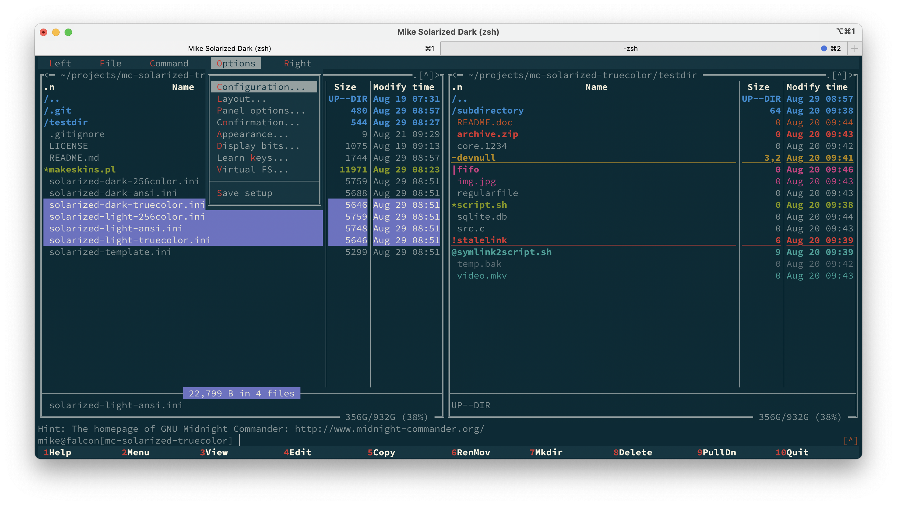
## Solarized light (truecolor)
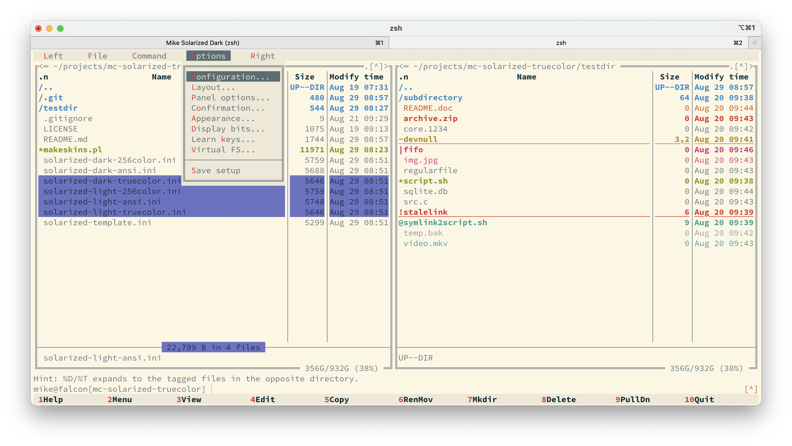

# Help Viewer
## Solarized dark (truecolor)
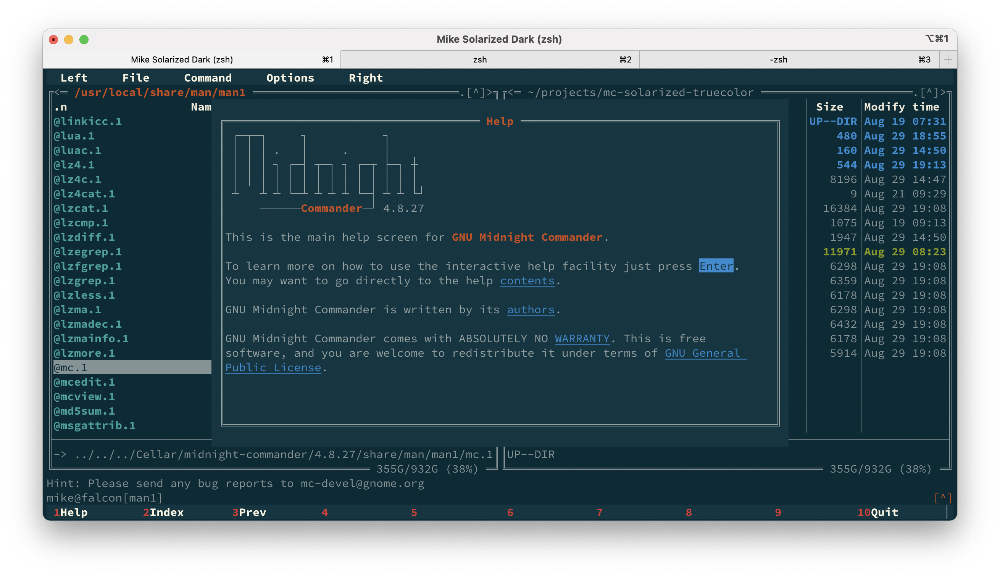
## Solarized light (truecolor)
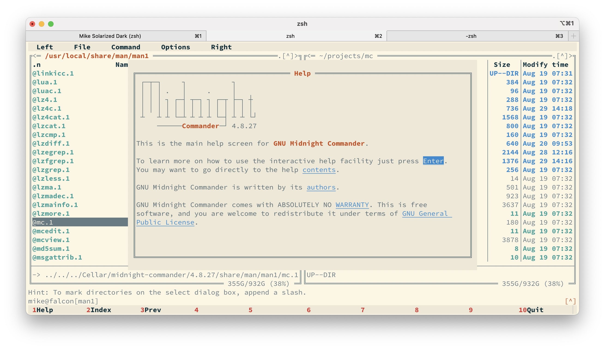

# Internal Viewer
## Solarized dark (truecolor)
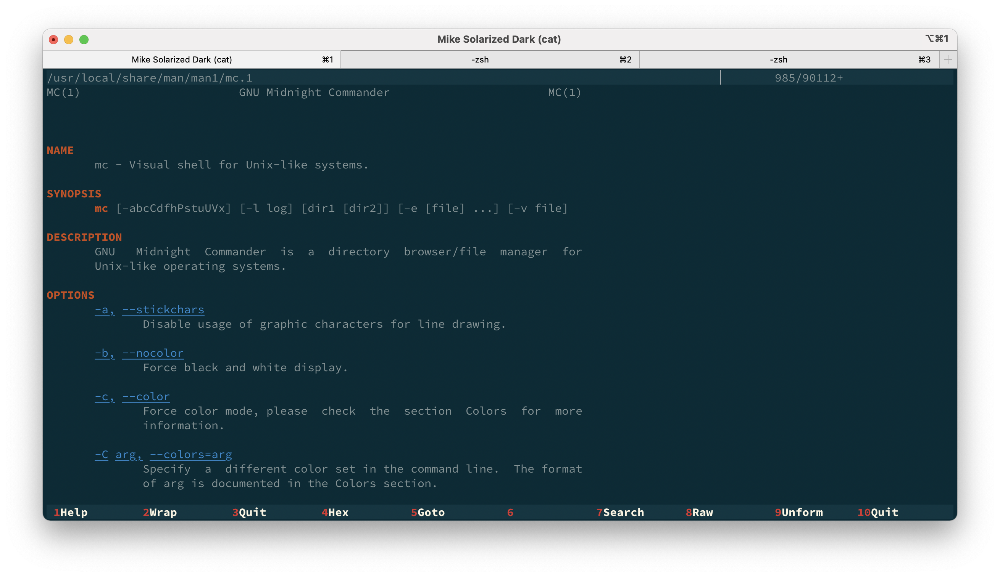
## Solarized light (truecolor)

# Internal Editor

There is a big caveat about the internal editor: syntax highlighting is not customizable by skins. Secondly, the syntax
files shipped with midnight commander use ANSI colors, so unless you configured your terminal to use the solarized color
palette for the 16 standard colors, the colors used for syntax-highlighted elements might not be from the solarized
palette at all.

Besides the non-deterministic colors resulting from the use of ANSI colors, the worst thing about the inability to
customize the syntax highlighting is that some of the colors are barely readable depending on the background used by the
skin. You can see this in the below screenshots in the light variant for the window that shows README.md. The markdown
syntax highlighting uses "lightgray" as the text color, which is ANSI color "white". In solarized light, this color is
used for the emphasized background. Used as foreground color on the standard solarized light background, it is barely
readable. There is a longstanding related [issue](https://midnight-commander.org/ticket/2172) concluding that light
background skins are problematic with the current syntax highlighting.

In the dark variant, the colors seem to work better but there may be problems with some filetypes as well that I did not
encounter yet.

## Solarized dark (truecolor)
### With standard syntax highlighting file

### With adapted syntax highlights shipped with this skin
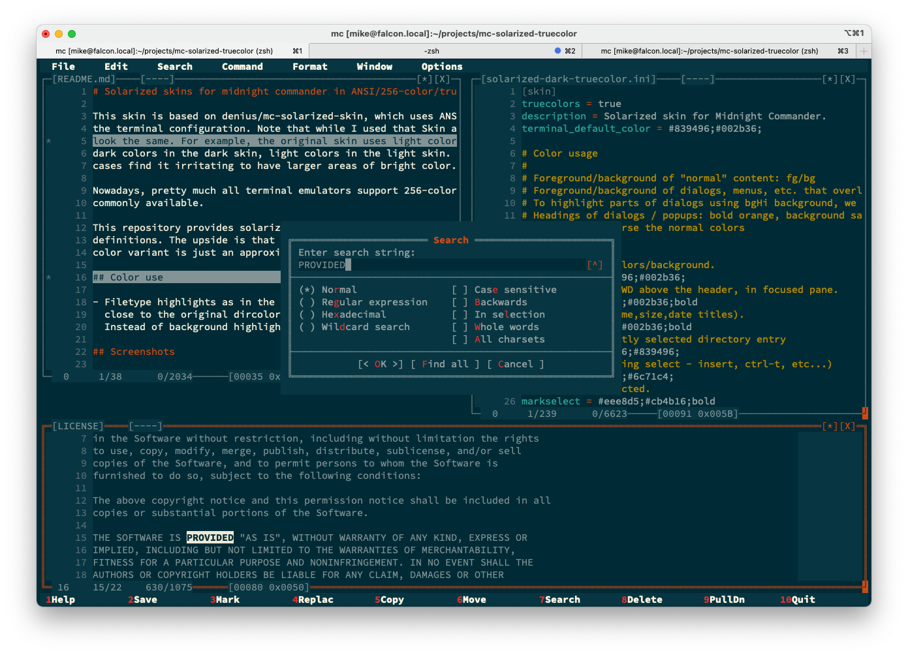

## Solarized light (truecolor)
### With standard syntax highlighting file
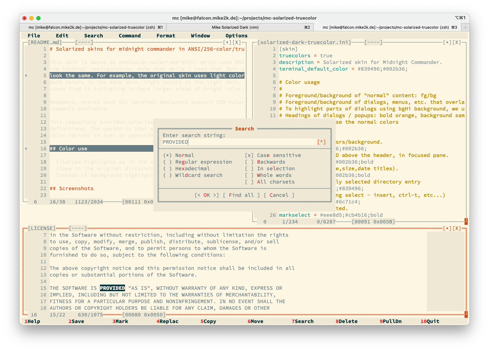
### With adapted syntax highlights shipped with this skin
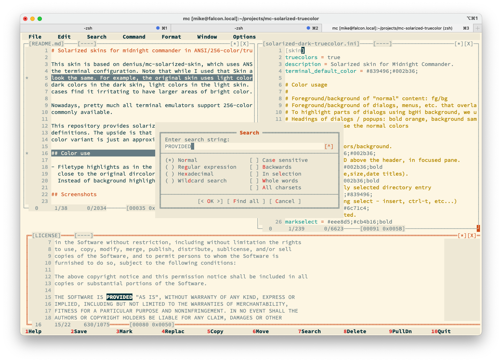

# Internal Diff
## Solarized dark (truecolor)
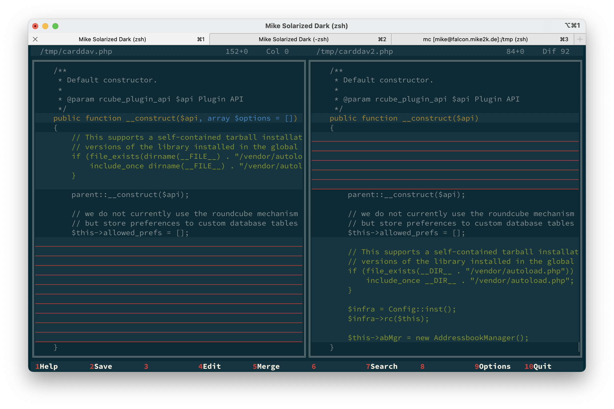
## Solarized light (truecolor)
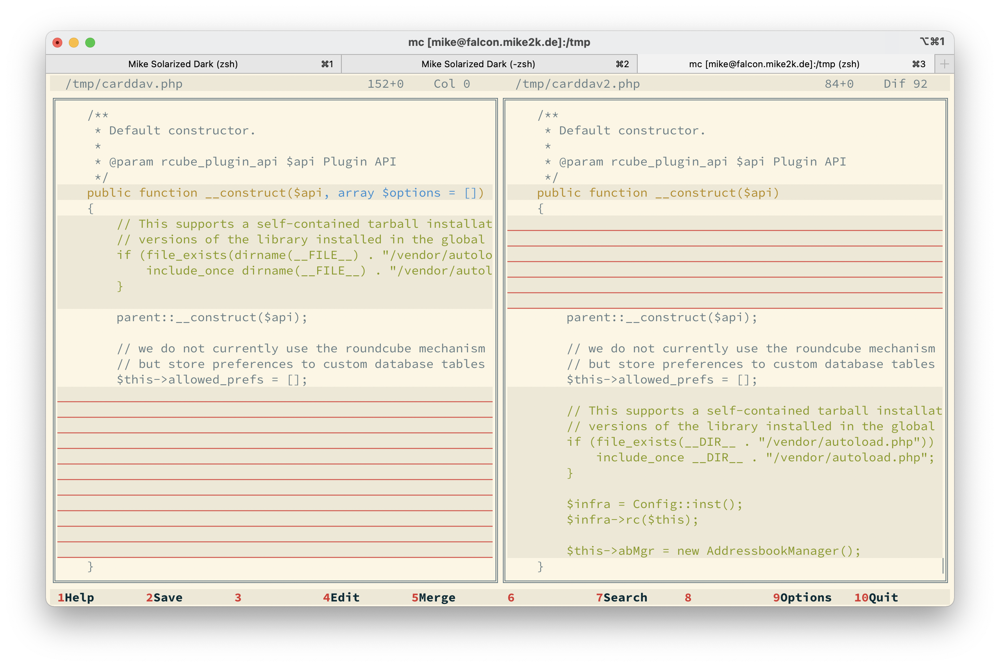

# History Dialog
Highlighted entries of the history dialog unfortunately use the color of focused hotkeys. This does fit the theme, but
cannot be avoided currently. See [ticket](https://midnight-commander.org/ticket/3160).

## Solarized dark (truecolor)
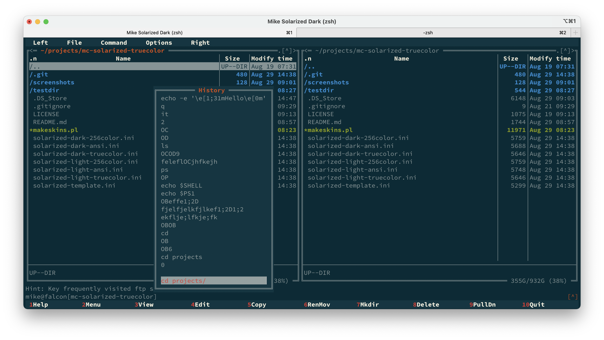

<!-- vim: set ts=4 sw=4 expandtab fenc=utf8 ff=unix tw=120: -->
