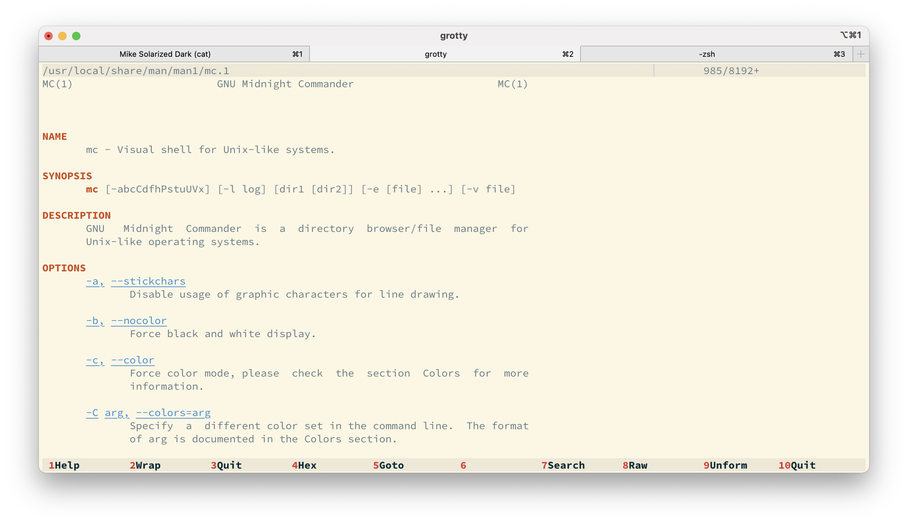

# Solarized dark (truecolor)

## Main Panel

## Help Viewer

## Internal Viewer

## History Dialog
Highlighted entries of the history dialog unfortunately use the color of focused
hotkeys. This does fit the theme, but cannot be avoided currently. See
[ticket](https://midnight-commander.org/ticket/3160).

# Solarized light (truecolor)
## Main Panel

## Help Viewer

## Internal Viewer

